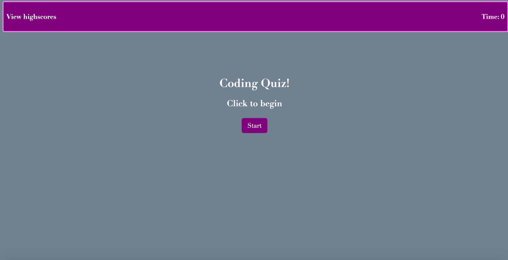
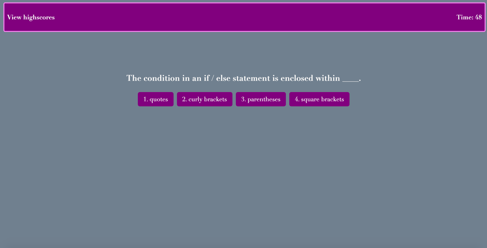
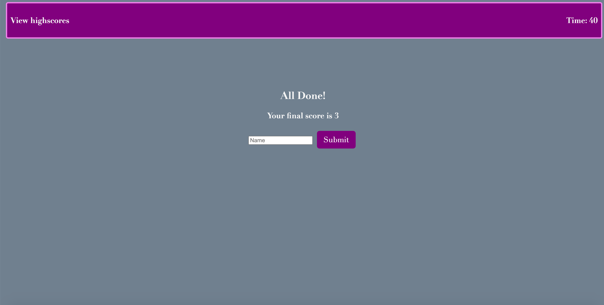

For this assignment I was tasked with making a coding quiz website that would utilize css, js and html to display an interactive timed multiple choice quiz. Upon clicking the correct answers, scores are stored to be added to local storage. Upon clicking the wrong answer, 10 seconds are subtracted from the time remaining in the quiz.
https://ethanfregien2233.github.io/code-quiz/
https://github.com/ethanfregien2233/code-quiz

